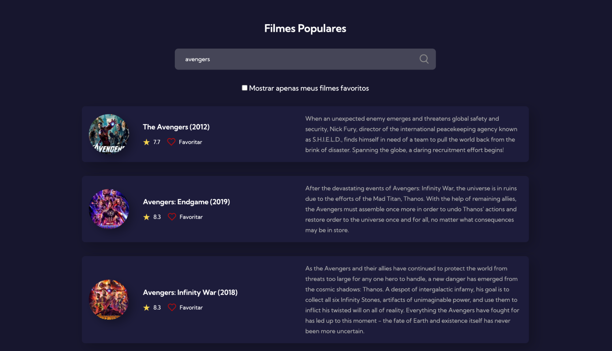

  

<h1 align="center">
  
  
  
  
  
</h1>
 

# Índice
[Sobre](#id1) 
[Layout](#id2) 
[Etapas](#id3) 
[Autora](#id99)

 

## 📌 Sobre 

Projeto desenvolvido no #7DaysOfCode da [Alura](https://www.alura.com.br/).

O objetivo do projeto é desenvolver uma página com filmes populares, consumindo a API [The Movie DataBase API](https://www.themoviedb.org/) com javascript puro.

 

## 📌 Layout

  

- Para conhecer os detalhes da página, acesso o [link do Figma](https://www.figma.com/file/FWRuSJRsk7FTIHOIc2Zi6d/Popular-Movies?node-id=0%3A1)

 

## 📌 Etapas

- Construção do layout com dados estáticos à partir do layout disponibilizado.
- Criação dinâmica dos filmes através do javascript e manipulação do DOM.
- Consumir a lista de filmes mais populares no momento, segundo a API do The Movie Database.
- Buscar filmes específicos com a barra de pesquisa quando o usuário apertar a tecla "Enter" ou clicar no ícone de pesquisa.

 

## 👩‍💼 Autora

<b>Nádia Ligia, budding back-end developer.</b>

&nbsp;
&nbsp;

